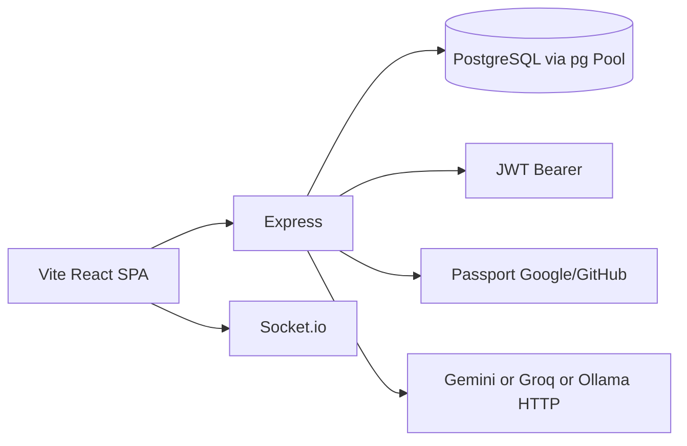

# Tudu — codebase truth

Last audited against codebase: 2026-10-10. Source files: 196 files checked (inventory in `.audit/all_files.txt`; excluded `node_modules`, `.git`, `.next`, `dist`). Truth source: `backend/migrations/init.sql` + `backend/package.json` + `frontend/package.json` + route/controller files. **`schema.prisma` does not exist.**

This document is what the repo **is**. Not a roadmap. Not marketing.

---

## 1. What this product actually is

Tudu is a **split PERN todo/Kanban app**:

- `frontend/` — Vite + React SPA
- `backend/` — Express API + Socket.io
- PostgreSQL via the `pg` Pool (raw SQL). No Prisma, no Drizzle, no MongoDB, no ORM models folder.

There is **no root `package.json`**. There is **no Docker / docker-compose**. There is **no `LICENSE` file**. Backend `package.json` declares `"license": "ISC"`. Frontend `package.json` has no `license` field.

It is a personal/small-team Kanban + list app with OAuth, sharing, Pomodoro, Chart.js analytics, and optional AI subtask suggestions. It is **not** an enterprise product. There is **no billing**, **no Stripe**, **no SSO beyond Google/GitHub OAuth**, **no SCIM**, **no `/ee` folder**, **no public API v1**, **no PWA plugin**.

---

## 2. Actual tech stack (from package.json)

### Backend (`backend/package.json`, name `tudu-backend`, version `1.0.0`)

**Runtime scripts:** `dev`, `build`, `start`, `migrate`, `test`, `test:unit`, `test:integration`, `test:coverage`, `test:watch`.

**dependencies (exact versions declared):**

| Package | Version | Used in code? |
|---|---|---|
| express | ^4.18.2 | YES — `backend/src/app.ts` |
| pg | ^8.11.3 | YES — `backend/src/config/database.ts` (`Pool`) |
| passport | ^0.7.0 | YES — `backend/src/config/passport.ts` |
| passport-google-oauth20 | ^2.0.0 | YES |
| passport-github2 | ^0.1.12 | YES |
| jsonwebtoken | ^9.0.2 | YES — `backend/src/utils/jwt.ts` |
| bcryptjs | ^2.4.3 | YES — `backend/src/controllers/authController.ts` |
| express-session | ^1.17.3 | YES — `app.ts` (Passport session) |
| helmet | ^7.1.0 | YES |
| cors | ^8.8.5 wait: `^2.8.5` | YES |
| express-rate-limit | ^7.1.5 | YES (`/api/`, `/auth`, credentials, AI) |
| socket.io | ^4.7.2 | YES — `backend/src/socketServer.ts` |
| dotenv | ^16.3.1 | YES |
| chrono-node | ^2.6.1 | YES — `nlpService.ts` |
| date-fns | ^2.30.0 | present in package.json; NLP uses chrono-node |
| zod | ^3.22.4 | **DECLARED, NEVER IMPORTED.** Grep `from 'zod'` in `*.ts` = 0. Only appears in `ENTERPRISE_ROADMAP.md`. |
| node-cron | ^3.0.3 | **DECLARED, NEVER IMPORTED.** Grep `cron` in `*.ts`/`*.tsx` = 0. README claims "Cron Jobs: node-cron for overdue tasks". **LIE.** |

**devDependencies:** typescript ^5.3.3, ts-node, ts-node-dev, jest ^29.7.0, ts-jest, supertest, socket.io-client, various `@types/*`.

**Missing from backend deps (claimed elsewhere):** prisma, mongoose, stripe, node-saml, swagger, sentry.

### Frontend (`frontend/package.json`, name `tudu-frontend`, version `1.0.0`)

**scripts:** `dev`, `build`, `preview`, `test`, `test:watch`, `test:coverage`, `test:e2e`, `test:e2e:ui`, `lint`.

**dependencies:**

| Package | Version |
|---|---|
| react / react-dom | ^18.2.0 |
| react-router-dom | ^6.20.1 |
| vite (dev) | ^5.0.8 |
| typescript (dev) | ^5.2.2 |
| zustand | ^4.4.7 |
| @tanstack/react-query | ^5.14.2 |
| axios | ^1.6.2 |
| @dnd-kit/core | ^6.1.0 |
| @dnd-kit/sortable | ^8.0.0 |
| @dnd-kit/utilities | ^3.2.2 |
| socket.io-client | ^4.7.2 |
| chart.js | ^4.4.0 |
| react-chartjs-2 | ^5.2.0 |
| chrono-node | ^2.6.1 |
| date-fns | ^2.30.0 |
| @vercel/analytics | ^2.0.1 |
| tailwindcss (dev) | ^3.3.6 |

**dev/test:** vitest ^2.1.9, playwright ^1.63.0, testing-library, eslint, postcss, autoprefixer.

**NOT installed:** canvas-confetti, react-joyride, vite-plugin-pwa, stripe, prisma client.

### Auth (what is actually imported)

- Passport Google + GitHub OAuth strategies (`passport.ts`)
- Email/password with bcrypt + JWT (`authController.ts`, `utils/jwt.ts`)
- Request auth middleware: Bearer JWT (`backend/src/middleware/auth.ts`) — `authenticate` / `optionalAuth`
- Socket handshake also verifies JWT (`socketServer.ts`)

OAuth routes are **GET**, not POST:

- `GET /auth/google`, `GET /auth/google/callback`
- `GET /auth/github`, `GET /auth/github/callback`
- `POST /auth/register`, `POST /auth/login`, `GET /auth/me`, `POST /auth/logout`

### Database (what is actually used)

- `new Pool({ connectionString: process.env.DATABASE_URL })`
- Schema applied by `backend/migrations/run.ts` reading **`backend/migrations/init.sql`** (`npm run migrate`)
- Hosting is not encoded in code. README *claims* Neon + Render + Vercel. `frontend/vercel.json` exists (SPA rewrite). No Render YAML. No Neon-specific client.

---

## 3. Actual DB schema

**MISSING:** `schema.prisma`, `drizzle.config.*`, `schema.sql` at root.

**SOURCE OF TRUTH:** `backend/migrations/init.sql` (copied below in full, minus comments that only narrate the roadmap).

Tables that exist:

1. `users`
2. `tasks` (plus later columns `board_id`, `column_id`, `assignee_id`)
3. `subtasks`
4. `activity_log`  ← per-user **task activity**, not enterprise audit
5. `shared_lists` (plus `status` default `'pending'`)
6. `pomodoro_sessions`
7. `boards`
8. `board_columns` (not `columns`; not SERIAL)
9. `workspaces`
10. `workspace_members`
11. `board_members`  ← table exists; **no INSERT/invite route found**. Only SELECTed for role resolution.

IDs are **UUID** (`gen_random_uuid()`), not INTEGER SERIAL. Task table is **`tasks`**, not `todo`/`todos`. Status column was **not** dropped.

```sql
CREATE TABLE IF NOT EXISTS users (
  id UUID PRIMARY KEY DEFAULT gen_random_uuid(),
  email VARCHAR(255) UNIQUE NOT NULL,
  name VARCHAR(255),
  password VARCHAR(255),
  provider VARCHAR(50),
  provider_id VARCHAR(255),
  avatar_url TEXT,
  created_at TIMESTAMP DEFAULT NOW(),
  updated_at TIMESTAMP DEFAULT NOW()
);

CREATE TABLE IF NOT EXISTS tasks (
  id UUID PRIMARY KEY DEFAULT gen_random_uuid(),
  user_id UUID REFERENCES users(id) ON DELETE CASCADE,
  title VARCHAR(500) NOT NULL,
  description TEXT,
  category VARCHAR(50) CHECK (category IN ('work', 'personal', 'study')),
  priority VARCHAR(50) CHECK (priority IN ('low', 'medium', 'high')),
  due_date TIMESTAMP,
  status VARCHAR(50) DEFAULT 'todo' CHECK (status IN ('todo', 'doing', 'done')),
  created_at TIMESTAMP DEFAULT NOW(),
  updated_at TIMESTAMP DEFAULT NOW()
);

CREATE TABLE IF NOT EXISTS subtasks (
  id UUID PRIMARY KEY DEFAULT gen_random_uuid(),
  task_id UUID REFERENCES tasks(id) ON DELETE CASCADE,
  title VARCHAR(500) NOT NULL,
  completed BOOLEAN DEFAULT FALSE,
  created_at TIMESTAMP DEFAULT NOW(),
  updated_at TIMESTAMP DEFAULT NOW()
);

CREATE TABLE IF NOT EXISTS activity_log (
  id UUID PRIMARY KEY DEFAULT gen_random_uuid(),
  user_id UUID REFERENCES users(id) ON DELETE CASCADE,
  task_id UUID REFERENCES tasks(id) ON DELETE CASCADE,
  action VARCHAR(100),
  details JSONB,
  created_at TIMESTAMP DEFAULT NOW()
);

CREATE TABLE IF NOT EXISTS shared_lists (
  id UUID PRIMARY KEY DEFAULT gen_random_uuid(),
  owner_id UUID REFERENCES users(id) ON DELETE CASCADE,
  shared_with_user_id UUID REFERENCES users(id) ON DELETE CASCADE,
  task_ids UUID[],
  permissions VARCHAR(50) DEFAULT 'read_write',
  created_at TIMESTAMP DEFAULT NOW()
);
ALTER TABLE shared_lists ADD COLUMN IF NOT EXISTS status VARCHAR(20) NOT NULL DEFAULT 'pending';

CREATE TABLE IF NOT EXISTS pomodoro_sessions (
  id UUID PRIMARY KEY DEFAULT gen_random_uuid(),
  user_id UUID REFERENCES users(id) ON DELETE CASCADE,
  task_id UUID REFERENCES tasks(id) ON DELETE SET NULL,
  duration INTEGER NOT NULL,
  completed_at TIMESTAMP,
  created_at TIMESTAMP DEFAULT NOW()
);

CREATE TABLE IF NOT EXISTS boards (
  id UUID PRIMARY KEY DEFAULT gen_random_uuid(),
  user_id UUID REFERENCES users(id) ON DELETE CASCADE,
  name VARCHAR(255) NOT NULL,
  position INTEGER NOT NULL DEFAULT 0,
  created_at TIMESTAMP DEFAULT NOW(),
  updated_at TIMESTAMP DEFAULT NOW()
);

CREATE TABLE IF NOT EXISTS board_columns (
  id UUID PRIMARY KEY DEFAULT gen_random_uuid(),
  board_id UUID REFERENCES boards(id) ON DELETE CASCADE,
  name VARCHAR(100) NOT NULL,
  position INTEGER NOT NULL DEFAULT 0,
  color VARCHAR(30) NOT NULL DEFAULT 'gray',
  stage VARCHAR(20) NOT NULL DEFAULT 'todo' CHECK (stage IN ('todo', 'doing', 'done')),
  wip_limit INTEGER CHECK (wip_limit IS NULL OR wip_limit >= 1),
  created_at TIMESTAMP DEFAULT NOW(),
  updated_at TIMESTAMP DEFAULT NOW()
);

ALTER TABLE tasks ADD COLUMN IF NOT EXISTS board_id UUID REFERENCES boards(id) ON DELETE CASCADE;
ALTER TABLE tasks ADD COLUMN IF NOT EXISTS column_id UUID REFERENCES board_columns(id) ON DELETE SET NULL;

CREATE TABLE IF NOT EXISTS workspaces (
  id UUID PRIMARY KEY DEFAULT gen_random_uuid(),
  owner_id UUID REFERENCES users(id) ON DELETE CASCADE,
  name VARCHAR(255) NOT NULL,
  created_at TIMESTAMP DEFAULT NOW(),
  updated_at TIMESTAMP DEFAULT NOW()
);

CREATE TABLE IF NOT EXISTS workspace_members (
  workspace_id UUID REFERENCES workspaces(id) ON DELETE CASCADE,
  user_id UUID REFERENCES users(id) ON DELETE CASCADE,
  role VARCHAR(20) NOT NULL DEFAULT 'member'
    CHECK (role IN ('admin', 'member', 'viewer')),
  created_at TIMESTAMP DEFAULT NOW(),
  PRIMARY KEY (workspace_id, user_id)
);

CREATE TABLE IF NOT EXISTS board_members (
  board_id UUID REFERENCES boards(id) ON DELETE CASCADE,
  user_id UUID REFERENCES users(id) ON DELETE CASCADE,
  role VARCHAR(20) NOT NULL DEFAULT 'member'
    CHECK (role IN ('admin', 'member', 'viewer')),
  created_at TIMESTAMP DEFAULT NOW(),
  PRIMARY KEY (board_id, user_id)
);

ALTER TABLE boards ADD COLUMN IF NOT EXISTS workspace_id UUID REFERENCES workspaces(id) ON DELETE SET NULL;
ALTER TABLE tasks ADD COLUMN IF NOT EXISTS assignee_id UUID REFERENCES users(id) ON DELETE SET NULL;
```

**Tables that do NOT exist (roadmap fiction):** `todo`, `todos`, `columns`, `integrations`, `github_mappings`, `audit_log` (different from `activity_log`), `board_templates`, `time_entries`, materialized view `task_metrics`.

---

## 4. Actual API routes (files + mounts)

Mounted in `backend/src/app.ts`:

| Mount | File |
|---|---|
| `GET /health` | `app.ts` inline |
| `/auth` | `backend/src/routes/auth.ts` |
| `/api/tasks` | `backend/src/routes/tasks.ts` |
| `/api/share` | `backend/src/routes/share.ts` |
| `/api/shared-lists` | `share.ts` (`sharedListsRouter`) |
| `/api/workspaces` | `backend/src/routes/workspaces.ts` |
| `/api/users` | `backend/src/routes/users.ts` (`GET /lookup`) |
| `/api/activity` | `backend/src/routes/activity.ts` |
| `/api/ai` | `backend/src/routes/ai.ts` |
| `/api/pomodoro` | `backend/src/routes/pomodoro.ts` |
| `/api/analytics` | `backend/src/routes/analytics.ts` |
| `/api/boards` | `backend/src/routes/boards.ts` (`boardsRouter`) |
| `/api/columns` | `backend/src/routes/boards.ts` (`columnsRouter`) |

### Auth (`auth.ts`)

- `POST /auth/register`
- `POST /auth/login`
- `GET /auth/google` + `GET /auth/google/callback`
- `GET /auth/github` + `GET /auth/github/callback`
- `GET /auth/me`
- `POST /auth/logout`

### Tasks (`tasks.ts`)

- `GET /api/tasks` — query: `status`, `category`, `priority`, `search` (ILIKE title/description). **No** `@me`, `due:`, saved presets, `sort`, `order`.
- `PATCH /api/tasks/batch`
- `GET /api/tasks/overdue`
- `GET /api/tasks/:id`
- `POST /api/tasks/parse`
- `POST /api/tasks`
- `PUT /api/tasks/:id/assign`  (controller comment wrongly says POST)
- `PUT /api/tasks/:id`
- `PATCH /api/tasks/:id/status`
- `DELETE /api/tasks/:id`
- Subtasks nested: `GET/POST /api/tasks/:taskId/subtasks`, `PATCH/DELETE /api/tasks/:taskId/subtasks/:subtaskId`

### Share

- `POST /api/share`, `GET /api/share`, `POST /api/share/accept`, `POST /api/share/decline`
- `GET /api/shared-lists`, `GET /api/shared-lists/:id`, `DELETE /api/shared-lists/:id`, `PATCH /api/shared-lists/:id/tasks/:taskId`

### Workspaces (API exists; UI members panel is a stub)

- `GET /api/workspaces`
- `POST /api/workspaces`
- `POST /api/workspaces/:id/invite`
- `PATCH /api/workspaces/:id/members/:memberId/role`
- `DELETE /api/workspaces/:id/members/:memberId`
- **MISSING:** `GET /api/workspaces/:id/members` (MembersPanel.tsx comment: "backend not wired")

### Boards / columns

- `GET/POST /api/boards`
- `GET/POST /api/boards/:boardId/columns`
- `PUT /api/boards/:boardId/columns/reorder`
- `GET/PUT/DELETE /api/boards/:id`
- `PUT /api/columns/reorder`
- `PUT/DELETE /api/columns/:id`
- **MISSING:** `POST /boards/:id/invite`, `GET /columns/:id/stats`, unprefixed `/boards`

### Other

- Activity: `GET /api/activity`, `GET /api/activity/:taskId`
- AI: `GET /api/ai/status`, `POST /api/ai/breakdown`
- Pomodoro: `POST /start`, `POST /complete`, `GET /active`, `GET /stats`
- Analytics: `GET /overview`, `/completed-tasks`, `/time-spent`

**Routes that do not exist as files:** `/auth/saml`, `/audit-log`, `/api/v1/*`, `/webhooks/github`, `/slack/command`, `/todos`, `/api/docs`, `/sitemap.xml`, `/pricing`, `/templates/*`, `/changelog`.

Controllers: `activityController`, `aiController`, `analyticsController`, `authController`, `boardController`, `pomodoroController`, `shareController`, `subtaskController`, `taskController`, `workspaceController`.

Services: `activityService`, `aiService`, `analyticsService`, `nlpService`, `realtimeService`.

---

## 5. Actual frontend — routes and features seen

**Router (`frontend/src/App.tsx`):**

| Path | UI |
|---|---|
| `/login` | Login |
| `/auth/callback` | AuthCallback |
| `/` | TaskList (dashboard) |
| `/board` | KanbanBoard |
| `/stats` | PomodoroStats |
| `/analytics` | AnalyticsDashboard (lazy) |
| `/shared/:id` | SharedListView |

**Components that exist (directories under `frontend/src/components/`):**

- `activity/` — ActivityFeed, RecentActivity, TaskActivity
- `ai/` — AiBreakdownModal
- `analytics/` — AnalyticsDashboard
- `auth/` — AuthCallback, Login, OAuthButton
- `common/` — BoardSelector, CheckPop, Confetti, ConfettiProvider, FilterDropdown, MemberBadge, ProtectedRoute, SearchBar, SyncIndicator, ThemeToggle, ToastContainer, Wordmark, WorkspaceSwitcher
- `kanban/` — ColumnManager, KanbanBoard, KanbanCard, KanbanColumn, logic.ts
- `layout/` — Header
- `onboarding/` — OnboardingPrompt, OnboardingRoot, ProductTour, TourButton
- `pomodoro/` — PomodoroRunner, PomodoroStats, PomodoroTimer, PomodoroTimerHeader, StartPomodoroButton
- `shared/` — MembersPanel (**stub UI**; does not fetch members)
- `sharing/` — Avatar, SharedListsSidebar, SharedListView, SharedWithMeSection, ShareInvites, ShareModal
- `tasks/` — SmartTaskInput, SubtaskList, TaskCard, TaskForm, TaskList

**Stores:** authStore, boardStore, filterStore, onboardingStore, pomodoroStore, socketStore, themeStore, uiStore, workspaceStore.

**Features that exist in code (no guessing):**

- Email + Google + GitHub login
- Task CRUD, categories work/personal/study, priorities, due dates, subtasks
- NLP parse via chrono-node + hashtags/keywords
- Kanban with dnd-kit, custom columns, colors, WIP limit **display**, multi-select drag to move (`PATCH /batch`)
- Board selector + workspace switcher in header
- List sharing by email (invite/accept/decline)
- Task activity log (not compliance audit)
- Pomodoro with header timer + stats page
- Analytics charts + CSV/JSON export (`frontend/src/lib/analyticsExport.ts`)
- Optional AI breakdown (Gemini / Groq / Ollama HTTP)
- Dark/light theme, onboarding tour (custom, not react-joyride), custom confetti (not canvas-confetti)
- Socket.io live sync + SyncIndicator
- Vercel Analytics snippet
- Jest + Vitest + Playwright tests exist

**Features NOT found:**

- Stripe / plans / paywall
- SAML / SCIM / domain SSO
- Enterprise `audit_log` export
- Board templates, GitHub/Slack integrations, public API keys
- PWA (`vite-plugin-pwa` MISSING, no service worker, no `manifest.webmanifest`)
- Offline IndexedDB queue
- Undo stack / Ctrl+Z
- Full bulk archive/delete bar
- Push notifications / node-cron jobs
- Keyboard command palette
- Import of Trello/JSON
- Docker
- `/ee` private enterprise package

---

## 6. Actual env vars

**`backend/.env.example` (this is the template; `.env` exists locally and was not copied here):**

- `DATABASE_URL`
- `JWT_SECRET`, `JWT_EXPIRES_IN`
- `GOOGLE_CLIENT_ID`, `GOOGLE_CLIENT_SECRET`, `GOOGLE_CALLBACK_URL`
- `GITHUB_CLIENT_ID`, `GITHUB_CLIENT_SECRET`, `GITHUB_CALLBACK_URL`
- `AI_PROVIDER`, `GEMINI_API_KEY`, `GROQ_API_KEY`, `AI_MODEL` (commented), `OLLAMA_URL` (commented)
- `SESSION_SECRET`
- `FRONTEND_URL`
- `PORT`, `NODE_ENV`

Also referenced in `aiService.ts` but **not** in `.env.example`: `GROQ_BASE_URL`, `GEMINI_BASE_URL`.

**`frontend/.env.example`:** `VITE_API_URL`, `VITE_SOCKET_URL`.

**Roadmap env vars that do not appear in code:** `SAML_ENTRY_POINT`, `SAML_ISSUER`, `SAML_CERT`.

---

## 7. Actual folder structure (depth)

```
tudu/
├── .audit/                 # created by this audit
├── backend/
│   ├── migrations/         # init.sql, run.ts
│   ├── src/
│   │   ├── config/         # database.ts, passport.ts
│   │   ├── controllers/
│   │   ├── middleware/     # auth.ts only (no error/validation middleware files)
│   │   ├── routes/
│   │   ├── services/
│   │   ├── types/
│   │   ├── utils/          # jwt.ts, socket.ts
│   │   ├── app.ts
│   │   ├── server.ts
│   │   └── socketServer.ts
│   ├── tests/              # unit + integration
│   ├── package.json
│   └── .env.example
├── frontend/
│   ├── e2e/
│   ├── public/             # favicon.png, wordmark.png, wordmark-dark.png
│   ├── src/                # components, hooks, lib, services, store, types, test
│   ├── package.json
│   ├── vercel.json
│   └── vite.config.ts
├── README.md
└── ENTERPRISE_ROADMAP.md
```

**Claimed by root README, MISSING on disk:**

- `backend/src/models/`
- `backend/README.md`
- `frontend/src/components/collaboration/`
- `frontend/src/utils/`
- `docker-compose`, `Dockerfile`

---

## 8. All markdown files found and what each claims

Inventory + glob `**/*.md` found **exactly two**:

| File | What it claims |
|---|---|
| `README.md` (root, 855 lines) | "Advanced PERN Stack Todo Application". Features list (auth, kanban, sockets, AI, pomodoro, analytics, onboarding). Stack matches package.json **except** node-cron usage and Zod usage. Schema section **omits** boards/workspaces/columns/assignee. API list **omits** boards/workspaces/columns/assign/batch/decline; **wrong** OAuth methods (POST vs GET); **wrong** subtask URLs (`PUT /api/subtasks/:id`). Structure invents `models/` and `backend/README.md`. License ISC. |
| `ENTERPRISE_ROADMAP.md` (1207 lines) | "Comprehensive Plan to Compete with Trello, Jira, Linear, and Monday". Mix of **aspirational SQL/JS** (SERIAL ids, table `todo`, drop `status`) and a **competitive table that marks Custom Columns, Team Permissions, GitHub Integration, WIP Limits, Keyboard Shortcuts, Mobile PWA as ✅ for Tudu**. Phase 5 SAML/Audit marked Planned. MVP Launch checklist marks custom columns / team permissions / power filters / PWA as ✅. **This is the fake enterprise document.** |

No `docs/*.md` existed before this audit. No `readme/` folder. No backend/frontend README files.

---

## 9. Honest implementation status vs "enterprise"

The user said they implemented **zero** enterprise features from the fake README. That is **true for SAML, SCIM, audit export, templates, integrations, public API, PWA, billing**.

It is **false** that *nothing* overlapping Phase 1 exists. Custom boards/columns, WIP fields, workspaces + invite API, assignee column, and multi-card move **are in this repo**. They use a **different schema** than the roadmap's fake SQL. The members UI is unfinished. `board_members` is a dead table (no writes). Power-filter syntax from the roadmap is **not** implemented.


