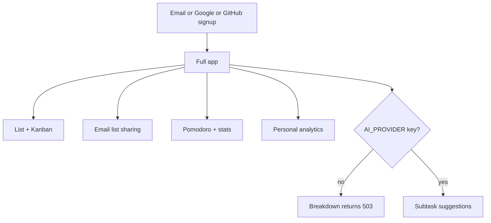

Last audited against codebase: 2026-10-10. Source files: 196 files checked. Truth source: schema.prisma (MISSING — real schema is `backend/migrations/init.sql`) + `backend/package.json` + `frontend/package.json`.

# Free tier — what the product actually is today

Tudu has **no billing, no plans table, no feature flags**. Every signed-in user already gets the whole app. “Free” is not a product SKU; it is the default because **payments are MISSING**.

This file audits what works **without** a paid key and **without** Stripe, then lists gaps a real free Trello alternative still needs.



---

## What free users get today (verified in code)

These exist as routes + UI. No plan check wraps any of them.

| Capability | Where it lives |
|---|---|
| Email/password auth | `backend/src/controllers/authController.ts`, `frontend/src/components/auth/Login.tsx` |
| Google + GitHub OAuth | `backend/src/config/passport.ts`, `OAuthButton.tsx` |
| Tasks: CRUD, work/personal/study, priority, due dates | `backend/src/routes/tasks.ts`, `TaskList.tsx`, `TaskForm.tsx` |
| Subtasks | nested under `/api/tasks/:taskId/subtasks` |
| Natural-language parse | `nlpService.ts`, `SmartTaskInput.tsx` |
| Kanban + custom columns + WIP badge | `KanbanBoard.tsx`, `ColumnManager.tsx`, `/api/boards`, `/api/columns` |
| Multi-card drag move | `PATCH /api/tasks/batch` |
| Board selector | `BoardSelector.tsx` |
| Workspaces API (create/list/invite/role/remove) | `backend/src/routes/workspaces.ts` |
| Workspace switcher in header | `WorkspaceSwitcher.tsx` |
| Share lists by email (invite/accept/decline) | `/api/share`, `/api/shared-lists` |
| Task activity feed | `activity_log` table, `/api/activity` |
| Pomodoro + `/stats` | `/api/pomodoro`, `PomodoroRunner.tsx` |
| Analytics + CSV/JSON export | `/api/analytics`, `analyticsExport.ts` |
| Dark/light theme | `themeStore.ts` |
| Onboarding tour | `frontend/src/components/onboarding/` |
| Real-time sync | Socket.io, `SyncIndicator.tsx` |
| Confetti on complete | custom `Confetti.tsx` (not canvas-confetti) |

AI breakdown (`POST /api/ai/breakdown`) is **optional**. It needs `GEMINI_API_KEY` / `GROQ_API_KEY` / local Ollama on the **server**, not a user API key. With no provider configured, the rest of the app still runs (`aiService.ts` throws a clear 503 only for that feature).

OAuth needs Google/GitHub app credentials on the server. Email/password works without those.

---

## What is already in the DB but not a finished free product

| Piece | Status |
|---|---|
| `board_members` | Table exists. **No INSERT / invite-to-board route.** |
| `tasks.assignee_id` | Column + `PUT /api/tasks/:id/assign`. Thin UI. |
| `MembersPanel.tsx` | Stub: “backend not wired”. No `GET /api/workspaces/:id/members`. |
| WIP `wip_limit` | Stored + displayed. Not a hard server-side move block. |
| Unlimited boards | No quota. Anyone can `POST /api/boards`. |

There is **no** free-vs-pro gate anywhere. Grep for stripe/plan/subscription in `*.ts`/`*.tsx` = empty.

---

## Free features that are MISSING (should be added before paywalling)

A Trello alternative’s free tier is judged on capture, backup, and self-serve. These are **not in the repo**:

| Gap | Why it matters | Suggested home |
|---|---|---|
| Trello / CSV / JSON **import** | Switching cost. RepoRank visitors will bounce without it. | `backend/src/controllers/importController.ts`, `POST /api/import` |
| Board/task **export** beyond analytics CSV | Data portability, AGPL goodwill. | `GET /api/boards/:id/export` |
| **Templates** (personal, not EE) | Empty-board death. | `board_templates` table — MISSING today |
| **Offline / PWA** | Roadmap claimed it; `vite-plugin-pwa` not installed. | `frontend` VitePWA + IndexedDB queue |
| Undo delete | Hard deletes only. | toast + restore in `taskController` |
| Board-level invites | `board_members` is dead weight. | `POST /api/boards/:id/invite` |
| Members list UI | API invite exists; panel is fake. | wire `MembersPanel.tsx` |
| `GET /api/workspaces/:id/members` | Frontend cannot list members. | `workspaces.ts` |
| Saved filters | Only `status\|category\|priority\|search`. | `filterStore.ts` is local UI, not power-syntax |
| Docker Compose | Self-hosters on r/selfhosted need one file. | MISSING — do not claim it |
| LICENSE file | Backend says ISC; no root license. Confusing for OSS acquisition. | root `LICENSE` |

Do **not** put SAML, SCIM, or audit export on the free list. Those are enterprise and also **0% built**.

---

## Where limits should be enforced (when you add a plan)

Today: **nowhere**. When Pro exists, enforce on the server. Never only in React.

| Limit (proposed) | Enforce in | Why |
|---|---|---|
| Max boards per user | `boardController.createBoard` | `POST /api/boards` has no count check |
| Max workspace members | `workspaceController.inviteToWorkspace` | invite is unbounded |
| AI breakdown quota | `aiController.breakdownTask` (already has 10/min IP limiter) | per-user daily cap on top |
| Max tasks / attachments | `taskController.createTask` | no attachments table yet |
| Plan lookup | **MISSING** `lib/billing.ts` | no file to import |

Proposed shared helper (does not exist):

```
backend/src/lib/billing.ts          # getPlan(userId) — NOT IMPLEMENTED
backend/src/middleware/requirePlan.ts # NOT IMPLEMENTED
```

Read plan from a **new** `users.plan` column or `subscriptions` table — neither exists in `init.sql`.

---

## Honest free-tier positioning

Ship Tudu as: **open-source Trello alternative for one person or a tiny team**, with Kanban, Pomodoro, and optional free-provider AI. Do not market “unlimited team permissions” until `MembersPanel` is real and `board_members` is written.

Self-hosters get the same binary as cloud users until `/ee` exists (it does not).
