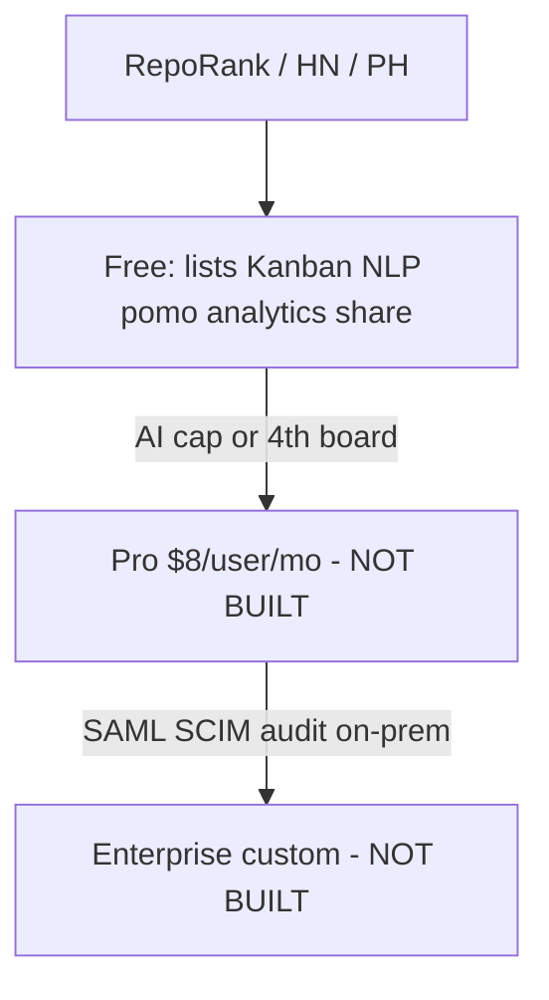

Last audited against codebase: 2026-10-10. Source files: 196 files checked. Truth source: schema.prisma (MISSING — real schema is `backend/migrations/init.sql`) + `backend/package.json` + `frontend/package.json`.

# Monetization runbook

How Tudu makes money without lying about the codebase.

**Today’s revenue: $0.** No Stripe, no license keys, no `/ee`. License on backend package.json is **ISC** (permissive). There is **no root LICENSE**. Open-core (AGPL + private `/ee`) is a **future legal change**, not current fact. Changing license needs a conscious commit and contributor agreement; do not claim AGPL until the file exists.

---

## Open-core model (target)

| Layer | License (proposed) | Code | Status |
|---|---|---|---|
| Kanban, auth, share, pomo, analytics | AGPL-3.0 (today: ISC) | `frontend/`, `backend/` public | Shipped |
| Pro: Stripe, higher caps, integrations | hosted SKU + optional license | `lib/billing.ts` | MISSING |
| Enterprise: SSO, SCIM, audit, admin | proprietary `/ee` | `/ee/` | **MISSING — do not ship empty folder as a product** |

AGPL on the root pushes hosters who modify Tudu as a network service to share changes. Keep `/ee` **out of the public remote** (private repo or submodule). ISC today allows Amazon to resell the whole app with no share-back — fine for acquisition, bad for a paid moat.

---

## Funnel vs actual features

| Stage | What they get **in this repo** | What you charge for later |
|---|---|---|
| Free | Everything that works today | Caps you have not coded |
| Pro | Same code + Stripe entitlement | AI quota, extra boards, future GitHub/Slack |
| Enterprise | Nothing extra in git | SSO, SCIM, audit_events, support, `/ee` |

Do not sell Enterprise until SAML is real. Selling “audit logs” that are `activity_log` rows would be the same class of lie as `ENTERPRISE_ROADMAP.md`.

---

## Revenue math (planning, not actuals)

Assumptions, not metrics (no PostHog in the app except `@vercel/analytics`):

| | Conservative | Base |
|---|---|---|
| Hosted MAU at 6 months | 300 | 1,000 |
| Paid conversion | 2% | 4% |
| Paid users | 6 | 40 |
| ARPU Pro | $8 | $8 |
| MRR | **$48** | **$320** |
| Enterprise (1 design partner) | $0 | $500–2k / mo invoice |

At 40 Pro seats you still cannot quit a job. Money unblocks when **hosted checkout works**, not when the roadmap hits week 18.

Self-host Pro licenses: $99/year/instance. Support load is the cost. Skip until Docker exists.

---

## What to build first to unblock money

**Payments before new Pro features.** You already have AI, extra boards, and workspaces to meter.

1. Stripe Checkout + `users.plan` (`PAYMENTS_README.md`)
2. Server-side caps on `createBoard` and `breakdownTask`
3. Upgrade modal on 402
4. Then: Trello import (acquisition), Docker (self-host), MembersPanel (so a team can justify Pro)
5. Then: GitHub webhooks (Pro wedge)
6. Then: `/ee` SSO (Enterprise)

Building SAML before Stripe = unpaid complexity.

---

## License verification idea (Pro self-host)

**NOT IMPLEMENTED.**

1. You issue a signed JWT or Ed25519 blob: `{ instanceId, seats, exp, features[] }`.
2. `backend/src/lib/licensing/verify.ts` (MISSING) checks signature with an embedded public key, caches 24h.
3. Offline grace: 14 days after `exp` then degrade AI + extra board create.
4. Phone-home optional; air-gap Enterprise uses a file drop.

This is not encryption of `/ee`. It is an honor+friction system.

---

## Preventing piracy of `/ee`

`/ee` does not exist yet. When it does:

| Control | Reality |
|---|---|
| Private GitHub repo / submodule | Best. Pirates cannot `git clone` EE. |
| Do not publish `/ee` to npm | Obvious |
| License check in SSO module | Stops casual copies; not NSA-grade |
| Watermark support contracts | Legal, not technical |
| AGPL core + proprietary EE | Customers who need SAML pay; clones get Kanban only |

You **cannot** stop a determined customer from dumping the SSO JS they run on their server. Price so the lawsuit/support stick is stronger than DRM theater. Do not obfuscate the public AGPL tree — that kills stars.

Never put SAML inside the public `passport.ts` “behind an if (plan)”. Forkers will delete the if.

---

## Pricing recap

| SKU | Price | Gate |
|---|---|---|
| Free hosted / self-host core | $0 | 3 boards, tiny AI quota (once coded) |
| Pro | $8/user/mo or $72/year | Stripe |
| Enterprise | starts ~$12/user/mo or $5k/year floor | SSO + audit + contract |

Trello Enterprise is expensive; you win on price only after the features are real. Until then, sell **hosted convenience + AI quota**, not “enterprise”.
