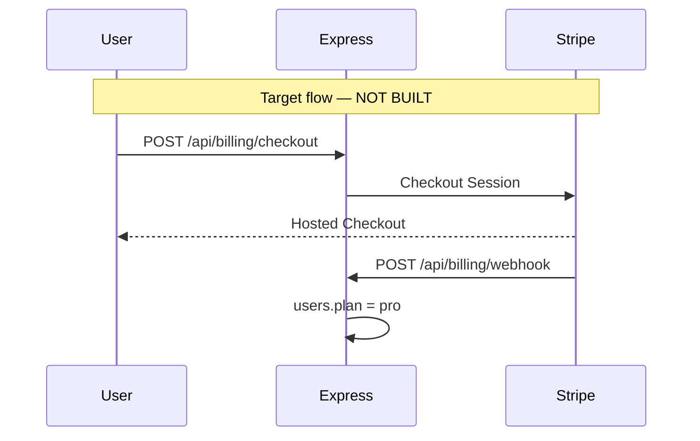

Last audited against codebase: 2026-10-10. Source files: 196 files checked. Truth source: schema.prisma (MISSING — real schema is `backend/migrations/init.sql`) + `backend/package.json` + `frontend/package.json`.

# Payments — implementation spec from scratch

**Stripe is not installed.** Grep `stripe` in `package.json` / `*.ts` / `*.tsx` = 0. There is no `lib/billing.ts`, no webhook route, no `plan` column.

`zod` is in backend `package.json` and unused — fine to use it here when you add Checkout payload validation.

---

## Current state

- Money in: **$0 path**
- Identity: JWT after email or OAuth
- Entitlement: implicit “everyone is free forever”



---

## Proposed DB fields (NOT in `init.sql`)

```sql
-- // PROPOSED
ALTER TABLE users
  ADD COLUMN IF NOT EXISTS plan VARCHAR(20) NOT NULL DEFAULT 'free',
  ADD COLUMN IF NOT EXISTS stripe_customer_id VARCHAR(255),
  ADD COLUMN IF NOT EXISTS stripe_subscription_id VARCHAR(255),
  ADD COLUMN IF NOT EXISTS plan_expires_at TIMESTAMP;

CREATE INDEX IF NOT EXISTS idx_users_stripe_customer ON users(stripe_customer_id);
```

Optional later: `billing_events` for webhook idempotency (`stripe_event_id UNIQUE`).

Do not reuse `activity_log` for invoices.

---

## Proposed API routes (MISSING)

| Method | Path | Auth | Purpose |
|---|---|---|---|
| `POST` | `/api/billing/checkout` | JWT | Create Stripe Checkout Session (Pro) |
| `POST` | `/api/billing/portal` | JWT | Stripe Customer Portal |
| `POST` | `/api/billing/webhook` | Stripe signature | **No JWT.** Raw body. |
| `GET` | `/api/billing/me` | JWT | `{ plan, status, renewsAt }` |

Mount next to the others in `backend/src/app.ts`. Webhook **must** use `express.raw({ type: 'application/json' })` on that path only; `app.use(express.json())` will break signature verification if it parses first.

---

## Env vars (add to `backend/.env.example` when implementing)

```
STRIPE_SECRET_KEY=
STRIPE_WEBHOOK_SECRET=
STRIPE_PRICE_PRO_MONTHLY=
STRIPE_PRICE_PRO_YEARLY=
```

Frontend: `VITE_STRIPE_PUBLISHABLE_KEY` only if you use Stripe.js embedded. Hosted Checkout needs none.

None of these exist in `.env.example` today.

---

## How to gate Free / Pro

1. `getMe` includes `plan`.
2. `backend/src/middleware/requirePlan.ts` (MISSING) reads `users.plan` from DB, not from the JWT, so a stale token cannot keep Pro after cancel.
3. Return **402** `{ error: 'upgrade_required', feature: 'ai_breakdown' }`.
4. First gates (features that already exist):
   - `POST /api/ai/breakdown` after a monthly free quota
   - `POST /api/boards` after 3 boards
   - `POST /api/workspaces/:id/invite` after 5 members

Never gate login, task CRUD for the user’s first board, or sharing of a single list — that is the free Trello-alternative wedge.

---

## Step-by-step to integrate

1. Create a Stripe account and Products: `Tudu Pro` monthly + yearly prices. Copy price IDs.
2. `cd backend && npm install stripe`
3. Add SQL above to `init.sql` (or a new `migrations/002_billing.sql` and teach `run.ts` to run more than one file — **today `run.ts` only executes `init.sql`**).
4. Add `backend/src/routes/billing.ts` + `controllers/billingController.ts`.
5. Webhook handlers to implement:
   - `checkout.session.completed` → set `plan=pro`, store customer + subscription ids
   - `customer.subscription.updated` → sync status
   - `customer.subscription.deleted` → `plan=free`
6. Stripe CLI: `stripe listen --forward-to localhost:5000/api/billing/webhook`
7. Frontend: Upgrade button → `POST /api/billing/checkout` → `window.location = session.url`
8. Tests: new `backend/tests/integration/billing.integration.test.ts` with mocked Stripe — MISSING

**Do not** put card numbers in this repo. **Do not** claim webhooks work until the raw-body route exists.

---

## Self-host / no Stripe

Cloud Pro = Stripe. Self-host Pro = license key (`lib/licensing/` — MISSING). Enterprise = invoice + `/ee`. Do not force Stripe on air-gapped users; they will never hit Checkout.
