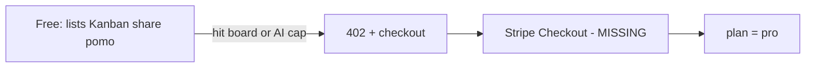

Last audited against codebase: 2026-10-10. Source files: 196 files checked. Truth source: schema.prisma (MISSING — real schema is `backend/migrations/init.sql`) + `backend/package.json` + `frontend/package.json`.

# Pro tier — NOT IMPLEMENTED

There is no Pro SKU in this repository. No Stripe. No `users.plan`. No paywall. The entire app is reachable after JWT auth.

This file defines what **should** be Pro, based on what the code already does (and what would be expensive or viral if left free forever). It is a spec, not a status report.

---

## What would be paywalled (proposal)

Built today, currently free to everyone:

| Feature | Why Pro |
|---|---|
| AI task breakdown | Hits Gemini/Groq; your API bill. File: `backend/src/services/aiService.ts` |
| Extra boards beyond a free cap | `POST /api/boards` is unbounded |
| Workspaces with >N members | `inviteToWorkspace` is unbounded |
| Analytics export | `frontend/src/lib/analyticsExport.ts` |
| Real-time multi-device as a “team” promise | Socket.io already on; packaging, not tech |

Not built — still reasonable Pro:

| Feature | Status |
|---|---|
| GitHub PR → card | MISSING (`/webhooks/github` does not exist) |
| Slack / Discord notifications | MISSING |
| Saved filter presets / power syntax | MISSING |
| Board templates gallery | MISSING |
| Public API keys + `/api/v1` | MISSING (zod unused) |
| PWA / offline | MISSING |
| Priority support | process, not code |

Do **not** put SAML, SCIM, audit export, or on-prem in Pro. Those belong in Enterprise and are also unbuilt.

---

## Proposed gate files (do not exist)

```
backend/src/lib/billing.ts           # getSubscription(userId)
backend/src/lib/licensing/            # license key verify for self-host Pro
backend/src/middleware/requirePlan.ts # 402 if plan < required
frontend/src/hooks/usePlan.ts         # read /api/me plan
frontend/src/components/billing/      # upgrade modal
```

`GET /auth/me` today returns the user row from `users` (email, name, avatar, provider). It has **no plan field**. Extend `authController.getMe` only after the column exists.

### Gate pattern (spec, not code to pretend is shipped)

1. `requirePlan('pro')` after `authenticate` on:
   - `POST /api/ai/breakdown` (or allow a tiny free quota then 402)
   - `POST /api/boards` when `COUNT(*) >= freeMax`
   - `POST /api/workspaces/:id/invite` when member count >= freeMax
2. Frontend: if 402, open upgrade UI. Never hide the only copy of a feature behind CSS.

---

## Pricing suggestion (not in product)

| | Free | Pro |
|---|---|---|
| Price | $0 | **$8 / user / month** or **$72 / year** |
| Boards | 3 (enforce later) | Unlimited |
| AI breakdowns | 20 / month or server-key optional | Higher cap or BYO key |
| Workspaces | 1, 5 members | Unlimited |
| Integrations | None | GitHub + Slack when built |
| Support | GitHub issues | Email |

Anchor vs Trello Standard (~$5–6/user) with: built-in Pomodoro + analytics + NLP, which Trello does not bundle on free.

Self-host Pro: same features, yearly license key (see `MONETIZATION_RUNBOOK.md`). **Not built.**



---

## Implementation order

Payments **before** Pro features. You already have the features; you lack the cash register. See `PAYMENTS_README.md`.

1. `users.plan` + Stripe customer id columns  
2. Checkout + webhook  
3. `requirePlan` on AI + board create  
4. Then build GitHub integration if you need a reason to upgrade besides caps
