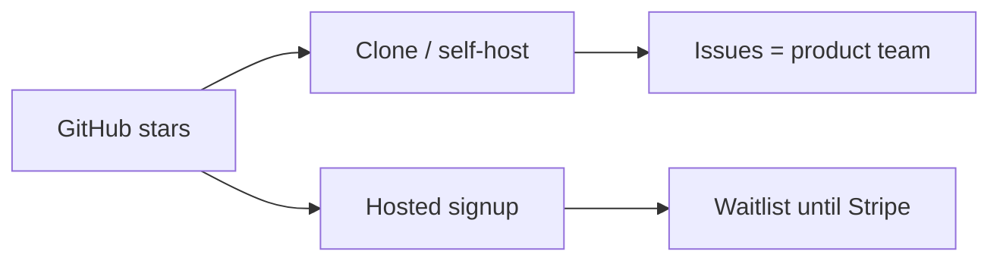

Last audited against codebase: 2026-10-10. Source files: 196 files checked. Truth source: schema.prisma (MISSING — real schema is `backend/migrations/init.sql`) + `backend/package.json` + `frontend/package.json`.

# User acquisition runbook

Tudu is an **open-source Trello alternative** (Kanban + lists), currently listed on [RepoRank as AI Tools / Kanban](https://reporank.net/en/repo/mojolaoluwaolanusi-tudu.html).

This runbook uses **actual** features from the audit. Do not pitch PWA, SAML, GitHub PR sync, or Docker until those files exist.

---

## Positioning (truthful)

**One line:** Tudu is a friendly open-source Kanban with built-in Pomodoro, personal analytics, natural-language tasks, and optional AI subtask breakdown.

**Vs Trello (what you can defend in a demo):**

- Drag-and-drop board with **custom columns** (`board_columns` + `ColumnManager.tsx`)
- **Pomodoro** in the header + `/stats` (Trello does not bundle this)
- **NLP**: “Buy milk tomorrow #personal”
- **AI breakdown** via Gemini/Groq/Ollama if the host sets a free key
- **Real-time** Socket.io across tabs
- Email + Google + GitHub login
- List sharing by email

**Do not say:**

- “Works offline / install as PWA” — `vite-plugin-pwa` MISSING
- “GitHub integration” — OAuth login only, no PR webhooks
- “Enterprise SSO / audit logs”
- “Docker one-command self-host” — no Compose file
- “Unlimited polished team RBAC” — `MembersPanel` is a stub; `board_members` has no writer

**RepoRank / AI Tools:** Lead with AI breakdown **as optional**, and Kanban as the product. AI without a key is disabled; the Kanban still works. That honesty survives comments.

---

## Asset gaps to fix before loud launch

| Asset | Status |
|---|---|
| 10s demo GIF (drag + pomodoro + NLP) | MISSING (`demo.gif` not in inventory) |
| Live demo URL in README | README is an 855-line setup manual |
| Docker Compose | MISSING |
| Root LICENSE | MISSING (backend package.json says ISC) |
| Comparison table that matches code | Old roadmap table is a lie |

Stars follow a cloneable README, not an internal wiki. Root README rewrite was skipped this pass; still required before Show HN.

---

## 30–60–90 day plan

### Days 1–30 — make the repo launchable

- Record a 15s GIF of: create task in English, drag to Done, confetti, Start 25m.
- Shorten marketing copy (when you do rewrite README): install from `backend` + `frontend` scripts that **exist** (`npm run migrate`, `npm run dev`). No fake Docker.
- Topics on GitHub: `kanban`, `trello-alternative`, `pomodoro`, `pern`, `react`, `self-hosted` (self-hosted is honest only if they can run Node + Postgres; say that).
- Reply on the RepoRank listing with the truthful one-liner.
- Submit:
  - [AlternativeTo — Trello alternative](https://alternativeto.net/)
  - [Awesome Selfhosted](https://github.com/awesome-selfhosted/awesome-selfhosted) **after** Compose exists; until then skip or they will reject
  - [There's An AI For That](https://theresanaiforthat.com/) — AI breakdown, disclose Gemini/Groq
  - Uneed, SaasHub, OpenAlternative

### Days 31–60 — communities

**Show HN template** (only claim shipped UI):

```
Show HN: Tudu – open-source Kanban with Pomodoro and optional AI breakdown

I got tired of Trello paywalling basics and of Linear assuming I'm on a
dev team. Tudu is a PERN Kanban: custom columns, email/Google/GitHub
auth, list sharing, a header Pomodoro, Chart.js stats, and “break this
into subtasks” via Gemini, Groq, or local Ollama.

Not a PWA yet. No Stripe yet. Team invites exist as an API; the members
UI is still thin.

Repo: https://github.com/<you>/tudu
```

**r/selfhosted** (after Docker, or be explicit):

```
Title: Tudu – AGPL/ISC Kanban + Pomodoro (Node + Postgres, no Docker yet)

Self-host with Node 18, Postgres, npm run migrate in /backend.
Looking for feedback from people who want Trello without the cloud.
What's the minimum you'd need in a compose file?
```

**r/productivity / r/SideProject:** demo GIF, mobile Safari screenshots (44px targets exist in the UI CSS claims — verify on a phone before posting).

**Product Hunt:** Tue–Thu 12:01am PST. First comment: senior PERN project, free AI providers, **no credit card**. Hunter + 5 friends in hour one. Do not list “offline PWA” in the PH gallery.

**Dev.to / Hashnode:** “Socket.io + dnd-kit Kanban” architecture post. Link the real files: `socketServer.ts`, `kanban/logic.ts`.

### Days 61–90 — convert stars to users

- Pin an issue: “Import from Trello” (free-tier gap).
- Changelog issue, not a fake `/changelog` route.
- Ask every star-er in a Discussion: hosted vs self-host. Hosted waitlist is a Google Form until Stripe exists.
- Double down on RepoRank / listicles with updated screenshots of `/board`, `/stats`, `/analytics`.



---

## Stars → users

Open source is the funnel, not a charity sidebar.

1. **Clone success** = `backend/.env.example` + `npm run migrate` actually works (it does, against `init.sql`).
2. **Issue templates** that capture “I came from Trello because ___”.
3. **OSS contributors** on MembersPanel / Docker — those close the stub gaps that block team users.
4. Do not private the repo. Do not move core Kanban into `/ee`. Core staying public is the acquisition engine.

RepoRank traffic should land on a 60-second story, not 855 lines of Vercel CLI instructions.
